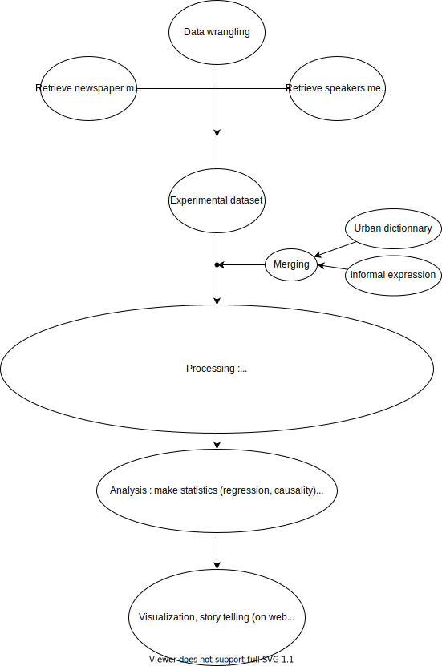

# ada-2021-project-adacadabra

### Title:
    
Exploratory analysis of the use of informal language in English speaking newspapers
    
### Abstract:
This project aims to perform data analysis on the [Quotebank](https://zenodo.org/record/4277311#.YY5tUy3pN-U) dataset which contains articles quotes from English speaking newspapers. The subject explored through this dataset is the use of colloquial language in the citations of US politician. To perform this analysis, the quotes are compared to the [Wikipedia list of English contractions]( https://en.wikipedia.org/wiki/Wikipedia:List_of_English_contractions) and categorized as formal or colloquial. Afterwards the evaluated quotes are analyzed enriched with additional metadata about the authors of these quotes. The used metadata are divided into two categories. The first one is speakers related and is retrieved using [Wikidata](https://www.wikidata.org/wiki/Wikidata:Main_Page). The second one is newspapers related and is retrieved by doing [WHOIS](https://en.wikipedia.org/wiki/WHOIS) requests on the web domains of quotes url. These investigations intend to show whether disparities occur in the use of informal language within specific groups. The third  analysis axis consists in a temporal approach addressing the evolution of the use of colloquial language.

 

### Project idea: 
The dataset could be used to identify the relation of the use of informal language and data about the speakers, quotes sources and time. This project could give information about the journalistic quality, the linguistic style, as well as its time evolution.

### Goals:
Find relations between the use of informal language and some metadata (politic orientation, occupation of the speaker).
    
### Motivations:
The idea for this project was born out of a general observation by a member of the group: the interview or newspaper archives give the impression that the language used was more formal than the one used today. In other words, the language is in constant evolution and the usage of colloquial language appears more and more frequently in the public debate. For example, the speech of Donald Trump during the two latest US electoral campaign is based on massive utilization of slang words and expressions, as it can be seen in the [nicknames he regularly gave to his opponents](https://en.wikipedia.org/wiki/List_of_nicknames_used_by_Donald_Trump) (like "Sleppy Joe" or "Crazy Hillary"). on a observé jusqu'à maintenant, nous on veut computer.

Given this intuition, the informal language seems to be an interesting subject to focus on. Therefore, the main dilemma is to study how to easily detect the use of colloquial language and find appropriate criteria that characterize it. Thanks to research and discussions with a graduate student in English literature, it appears that the usage of informal language is mainly linked to the usage of a specific vocabulary. Therefore, the large number of quotations containing in the Quotebank dataset seems to offer a great opportunity to obtain a general overview on these aspects.

        
### Story: 

| Step | idea | Description  |
|:---------|:-----------|:-----------|
|1. | Presentation of Quotebank | geographical representation, standard statistics with fancy representation to present the dataset |
|2. | Research question | Presentation of the RQ's, general descriptive plots about the politician in the US. |
|3. | Presentation of the method used to classify the quotes | description of the method and index used, results on the most used words, statistics on the frequency of each entry (i.e. Zipf law) |
|4. | Exploratory analysis |explore the relation between the metadata and the classification of the quotes |
|5. | Identify the key correlations | linear/logistic regression with coefficient which could have an influence on the output (informal/formal), statistical tests, ... | 
|6. | Explanatory study | choose a relation and investigate in depth how is it possible (or not) to explain it |
|7. | Conclusion | highlight the fact that correlation ≠ to causation, limits on our study |
    
#### Research Questions:

 

    
### Proposed additional datasets:
- Speakers metadata (see the notebook `SPEAKERS_METADATA/Retrieve_metadata.ipynb`): Using the provided parquet file, the information (gender, age, occupation, nationality, religion ...) of each speakers were extracted. The parquet file was converted into a dataframe and the QIDs into meaningful information thanks to the lookup table provided.

- Newspapers metadata (see the notebook `NEWSPAPER_METADATA/whois_requests.ipynb`) : The web domains of all entries URLs have been extracted and grouped into a domain dataframe. Using the package [python-whois](https://pypi.org/project/python-whois/), registered information for fields "organization, country, state, city" have been retrieved and added to the domain dataframe. It has been saved in a pickle file (cf. `NEWSPAPER_METADATA/whois_results.pkl`).  

    
### Methods:
**Process flow diagram of the project**

All the methods used to highlight the results in the Data Story are described and grouped in the notebook `DataAnalysis_Story`. The steps of data wrangling, data acquisition and dictionary compilation are maintained in the notebooks already present for Milestone 2.
    
The process has passed through the following steps:

- Create a sample to handle data size (see Notebook `Sample_creation.ipynb`)

- Data Wrangling (see Notebook `DATA_WRANGLING/Data Wrangling Quotebank.ipynb`)

    - Suppression of quotes according the following criteria
      
      - have meaningless probabilities (p not in interval [0,1])
      - is not clearly identified (threshold to be defined: *threshold_min*)
      - is probably confused with another speaker (threshold to be defined: *threshold_diff*)
      - is not identified (None values)

- Classification (see Notebook `\CLASSIFICATION\English_contractions\contractions_dictionary.ipynb` and `quotations_classification.ipynb`): 
  - The classification of the quotes are based on the [list of English contractions](https://en.wikipedia.org/wiki/Wikipedia:List_of_English_contractions) of Wikipedia. These 180 word formulations, according to the authors of the page, are to be avoided anywhere other than in direct quotations in encyclopedic prose. It consists simply to search for a specific word or expression from the dictionary in each quote of the dataset. If a match is found, the dictionary is updated to contain the number of time the contraction has been found in the quotes (38%). This value is then used to reduce the dictionary size with the removal of word that appear in more than a certain fraction of words defined by a threshold (0.02). This is why we will focus on the less frequently occurring terms (occurring less than in 2% of the quotes), which will define a clearer distinction between formal and informal language. This operation reduces the total number of colloquial quotes to about 10%.

Inspired from [Learning to Classify Documents According to Formal and Informal Style](https://citeseerx.ist.psu.edu/viewdoc/download?doi=10.1.1.364.4671&rep=rep1&type=pdf) (F.Sheikha, D.Inkpen 2012)

 
    
#### Work distribution withing the team:

The list of internal milestones during the entire project duration are detailed on the Trello platform ([link](https://trello.com/invite/b/sVkiju6l/95ca74a3fa2c4efd30a7d1e7ce646f25/milestone-2)).

| Name | nickname |
|:---------|:-----------|
|Alexandre Bugnard|BUA|
|Nicola Santacroce|SAN|
|Jules Gros-Daillon|DAJ|
|Marin Piguet|PIM|

| period | task | carried out by  |
|:---------|:-----------|:-----------|
|Milestone 1 | Reflection on the research topic | all | 
|Milestone 2 | Discussion of the topic to choose and the according methods | all |
|Milestone 2 | Create and extract a sample from the database | PIM | 
|Milestone 2 | Data Wrangling | BUA | 
|Milestone 2 | Word retrieval method investigations | BUA | 
|Milestone 2 | WHOIS requests | SAN |    
|Milestone 2 | Metadata on speakers | DAJ |
|Milestone 2 | README | all |
|Milestone 2 | Apply dictionary on quotes | PIM, BUA, SAN |
|Milestone 2 | Exploratory analysis on metadata | SAN, DAJ |
|Milestone 3 | Update README according TA comments| BUA |  
|Milestone 3 | Definition of the sample and extraction | PIM |
|Milestone 3 | Linear regression setup | BUA |
|Milestone 3 | Apply the dictionary to the sample | all |
|Milestone 3 | Aggregation by political speakers | DAJ |
|Milestone 3 | Map stats States Viz | SAN |
|Milestone 3 | Set up of the webpage with Jekyll | PIM |
|Milestone 3 | Sketch of the story, selection of the viz | all |
|Milestone 3 | Clean the notebook and merge in one | all |

    
