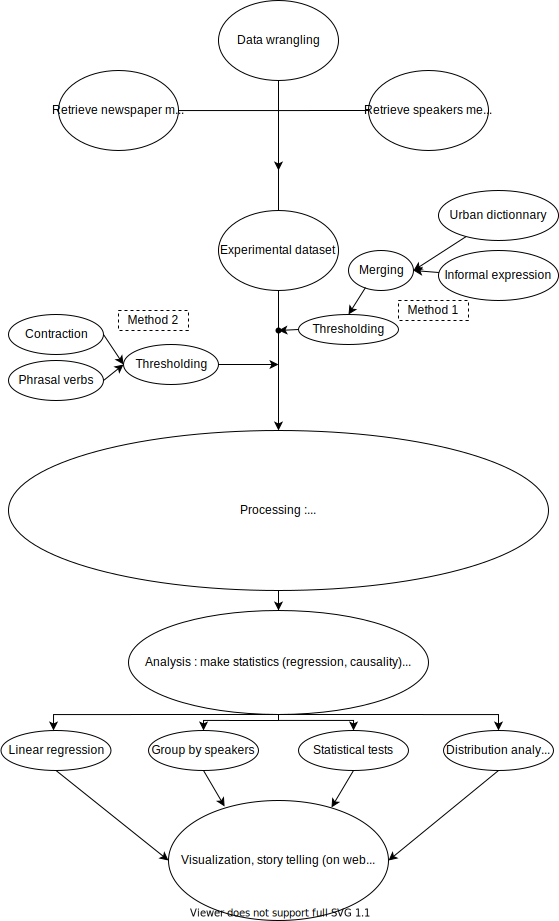

# ada-2021-project-adacadabra

### Title:
    
Exploratory analysis of the use of informal language in English speaking newspapers
    
### Abstract:
This project aims to perform data analysis on the [Quotebank](https://zenodo.org/record/4277311#.YY5tUy3pN-U) dataset which contains articles quotes from English speaking newspapers. The subject explored through this dataset is the use. To perform this analysis different classification methods have been tested. Detection of [slang language](https://en.wikipedia.org/wiki/Slang), [english contractions](https://en.wikipedia.org/wiki/Wikipedia:List_of_English_contractions) retrieval and [phrasal verbs](https://en.wikipedia.org/wiki/English_phrasal_verbs) occurrence are the main characteristics analyzed to better understand the notion on informality in written language. After a satisfying classification of the given quotes, the latter are enriched with additional metadata about the authors of these reported speeches. The used metadata is divided into two categories: the first one is speakers related and is retrieved using [Wikidata](https://www.wikidata.org/wiki/Wikidata:Main_Page). The second one is newspapers related and is retrieved by doing [WHOIS](https://en.wikipedia.org/wiki/WHOIS) requests on the web domains of quotes URL. These investigations intend to show whether disparities occur in the use of informal language within specific groups. 
Focus U.S politician

 

### Project idea: 
The dataset could be used to identify the relation of the use of informal language and data about the speakers, quotes sources, and time. The initial research topic was to perform exploratory and explanatory analyses on the classified dataset. Our naive approach to the classification of informal/formal quotes has led us to face certain difficulties. After some additional investigation on the classification methods, the process of detection appeared interesting enough and surprisingly uninvestigated to further dig down in the subject. The exploratory analysis that follows the treatment of the quotations is limited, but it nevertheless makes it possible to highlight some key points in the understanding of the mechanisms at work in the use of language in the media.

### Goals:
The project is divided into two main objectives:

- Find the main characteristics of formal style
- Find an appropriate method to classify the given quotes among formal and informal formulations.
- Find relations between the use of informal language and some metadata (politic orientation, occupation of the speaker, age, ...).
    
### Motivations:
The idea for this project was born out of a general observation by a member of the group: the interview or newspaper archives give the impression that the language used was more formal than the one used today (**à changer suivant notre amorce**). In other words, the language is in constant evolution and the usage of colloquial language appears more and more frequently in the public debate. For example, the speech of Donald Trump during the two latest US electoral campaigns is based on massive utilization of slang words and expressions, as it can be seen in the [nicknames he regularly gave to his opponents](https://en.wikipedia.org/wiki/List_of_nicknames_used_by_Donald_Trump) (like "Sleppy Joe" or "Crazy Hillary"). 

Additionally, studies on the subject of formal/informal formulation detection were not well studied. Given this intuition, informal language seems to be an interesting subject to focus on but it comes with the main dilemma: how to easily detect the use of colloquial language and find appropriate criteria that characterize it? A researche study on learning how to classify documents according to formal and informal style (F.Sheikha, D.Inkpen 2012)(https://citeseerx.ist.psu.edu/viewdoc/download?doi=10.1.1.364.4671&rep=rep1&type=pdf) can be taken as a guideline to guide us in achieving the distinction of these two styles. 

The final goal is to exploit the large number of quotations contained in the Quotebank dataset. It is about taking advantage of the great opportunity of having a general overview on the studied aspects and theire repartition among the types of speakers.

        
### Story: 

| Step | idea | Description  |
|:---------|:-----------|:-----------|
|1. | Presentation of the subject of investigation | Present the subject, make some hypotheses |
|2. | Presentation of Quotebank | geographical representation, standard statistics with fancy representation to present the [dataset sample](https://www.swisstransfer.com/d/ca6e8ab1-76d0-40c1-8d87-2540acf52ba2) |
|3. | Presentation of the metadata | Description of the processing required to get information about the authors, the scarcity of the data, sample, ...|
|4. | Presentation of the *naive method* used to classify the quotes | description of the Urban Dictionary (link), result obtained with this approach, limits, and problems.|
|5. | Presentation of *the contraction method* used to classify the quotes | description of the wiki page (link), result obtained with this approach, limits, and problems, justify its give up|
|6. | Presentation of the *phrasal verb method* used to enhance the  *the contraction method* | description of the Urban Dictionary (link), result obtained with this approach, limits, and problems.|
|7. | Exploratory analysis about the politician in the US | profit of the classified data and start to explore the relationship between the metadata and the classification of the quotes |
|8. | Identify the key relations | linear/logistic regression to spot the features which could influence the output (informal/formal), statistical tests, ... | 
|9. | Explanatory study | choose a relation and investigate in-depth how is it possible (or not) to explain it |
|10. | Conclusion | try to answer the initial question, qualify the initial hypotheses |

    
#### Research Questions:
- *what are the main features to detect informal language*
- *is it possible to infer language style (formal/informal) from relatively simple rules (slang words, presence of contrasts, presence of phrasal verbs)*
- *can we detect correlations between general features the use of informal language among U.S politician*

    
### Proposed additional datasets:
- **Speakers metadata** (see the notebook `SPEAKERS_METADATA/Retrieve_metadata.ipynb`): Using the provided parquet file, the information (gender, age, occupation, nationality, religion ...) of each speaker were extracted from the [wikidata](https://www.wikidata.org/wiki/Wikidata:Main_Page) free and open knowledge base. The parquet file was converted into a data frame and the QIDs into meaningful information thanks to the lookup table provided.

- **Newspapers metadata** (see the notebook `NEWSPAPER_METADATA/whois_requests.ipynb`): The web domains of all entries URLs have been extracted and grouped into a domain data frame. Using the package [python-whois](https://pypi.org/project/python-whois/), registered information for fields "organization, country, state, city" have been retrieved and added to the domain data frame. It has been saved in a pickle file (cf. `NEWSPAPER_METADATA/whois_results.pkl`).  

- **Wiki contraction to be avoided**: This dataset is an illustrative, non exhaustive [list of contractions](https://en.wikipedia.org/wiki/Wikipedia:List_of_English_contractions) that should not be used in Wikipedia articles. The contributors should avoid using them anywhere other than indirect quotations in encyclopedic prose. The methods of treatment of contractions prescribed by Wikipedia can be found in the notebook `CLASSIFICATION/English_contractions.ipynb`. The latter describes the methodology that leads to the data sample used for further analysis.

- **Urban dictionary**: It is a crowdsourced online dictionary for slang words and phrases. Urban Dictionary was intended as a dictionary of slang, or cultural words or phrases, not typically found in standard dictionaries. By July 2020, the dictionary had over 12 million definitions [A. Peckham 2020](https://urbandictionary.blog/post/2020-07-07-rethinking-the-dictionary/). The treatment of these data is described in the notebook `CLASSIFICATION/comparison_SlangDict_quotes.ipynb`.

    
### Methods:
**Process flow diagram of the project (à refaire)**

All the methods used to highlight the results in the Data Story are described and grouped in the notebook `DataAnalysis_Story`. The steps of data wrangling, data acquisition, and dictionary compilation are maintained in the notebooks already present for Milestone 2.
    
The process has passed through the following steps:

- Create a sample to handle data size (see Notebook `Sample_creation.ipynb`):

- Data Wrangling (see Notebook `DATA_WRANGLING/Data Wrangling Quotebank.ipynb`):

    - Suppression of quotes according to the following criteria
      
      - have meaningless probabilities (p not in interval [0,1])
      - is not identified (threshold to be defined: *threshold_min*)
      - is probably confused with another speaker (threshold to be defined: *threshold_diff*)
      - is not identified (None values)

- Classification (see Notebooks in `\CLASSIFICATION\...`): different classification methods (these are listed below) have been tried on the dataset. To start with rather naive and crude methods and then with more linguistically justified techniques:
  - The classification of the quotes is based on the [Urban dictionnary](https://www.urbandictionary.com/).
    In this notebook, we treat each quote of the corpus and assign them a score (binary variable determining if the quote is formal (0) or informal (1)) according the dictionnary of informal formulation and slang vocabulary (15'000 entries). If a match is found, the dictionary is updated to contain the number of times the slang word has been found in the quotes. Finally, a threshold is set to remove the most common slang word to avoid false positives. The process is detailed in `\CLASSIFICATION\comparison_SlangDict_quotes.ipynb`. 
  - The classification of the quotes is based on the [list of English contractions](https://en.wikipedia.org/wiki/Wikipedia:List_of_English_contractions) of Wikipedia. These 180-word formulations, according to the authors of the page, are to be avoided anywhere other than indirect quotations in encyclopedic prose. It consists of a simple search for a specific word or expression from the dictionary in each quote of the dataset. Similarly to the detection of slang words,  if a match is found, the dictionary is updated to contain the number of times the contraction has been found in the quotes (38%). This value is then used to reduce the dictionary size with the removal of the word that appears in more than a certain fraction of words defined by a threshold (0.02). This is why we will focus on the less frequently occurring terms (occurring less than in 2% of the quotes), which will define a clearer distinction between formal and informal language. This operation reduces the total number of colloquial quotes to about 10%.

  - The classification of the quotes is based on [phrasal verbs](https://www.phrasalverbdemon.com/): This feature could characterize informal texts,
as reported by Dempsey, McCarthy, and McNamara (2007). **A voir comment Nico fait** `\CLASSIFICATION\xxx.ipynb
 
    
#### Work distribution within the team:

The list of internal milestones during the entire project duration is detailed on the Trello platform ([link](https://trello.com/invite/b/sVkiju6l/95ca74a3fa2c4efd30a7d1e7ce646f25/milestone-2)).

| Name | nickname |
|:---------|:-----------|
|Alexandre Bugnard|BUA|
|Nicola Santacroce|SAN|
|Jules Gros-Daillon|DAJ|
|Marin Piguet|PIM|

| period | task | carried out by  |
|:---------|:-----------|:-----------|
|Milestone 1 | Reflection on the research topic | all | 
|Milestone 2 | Discussion of the topic to choose and the according to methods | all |
|Milestone 2 | Create and extract a sample from the database | PIM | 
|Milestone 2 | Data Wrangling | BUA | 
|Milestone 2 | Word retrieval method investigations | BUA | 
|Milestone 2 | WHOIS requests | SAN |    
|Milestone 2 | Metadata on speakers | DAJ |
|Milestone 2 | README | all |
|Milestone 2 | Apply dictionary on quotes | PIM, BUA, SAN |
|Milestone 2 | Exploratory analysis on metadata | SAN, DAJ |
|Milestone 3 | Update README according to TA comments| BUA |  
|Milestone 3 | Definition of the sample and extraction | PIM |
|Milestone 3 | Reporting issue on non-English quotes | SAN |
|Milestone 3 | Linear regression setup | BUA |
|Milestone 3 | Apply the dictionary to the sample | all |
|Milestone 3 | Aggregation by political speakers | DAJ |
|Milestone 3 | Phrasal verbs detection | SAN |
|Milestone 3 | Set up of the webpage with Jekyll | PIM |
|Milestone 3 | Sketch of the story, selection of the viz | all |
|Milestone 3 | Clean the notebook and merge in one | all |